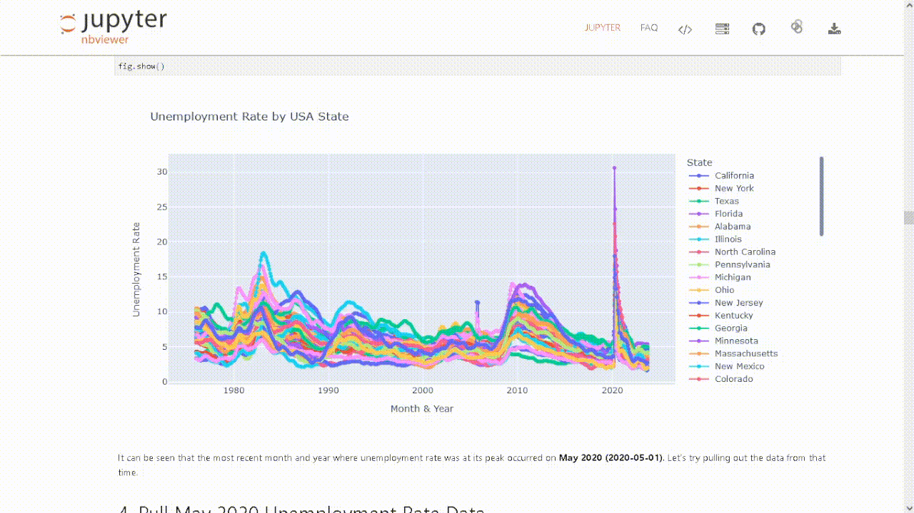
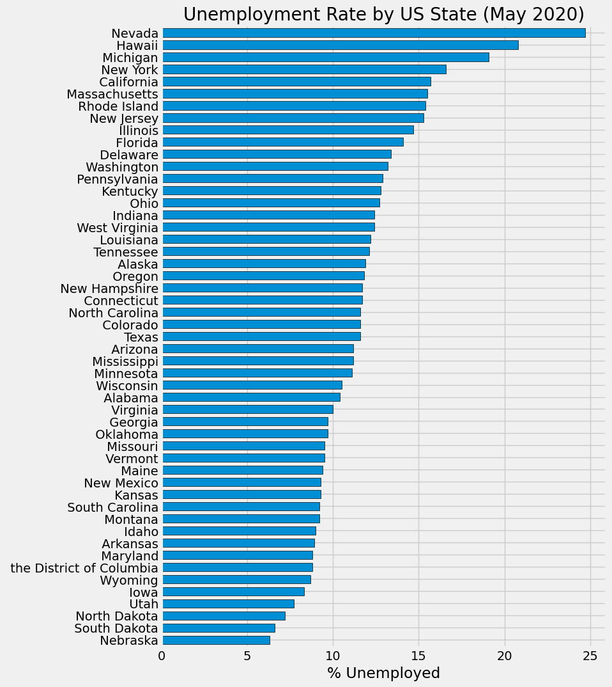
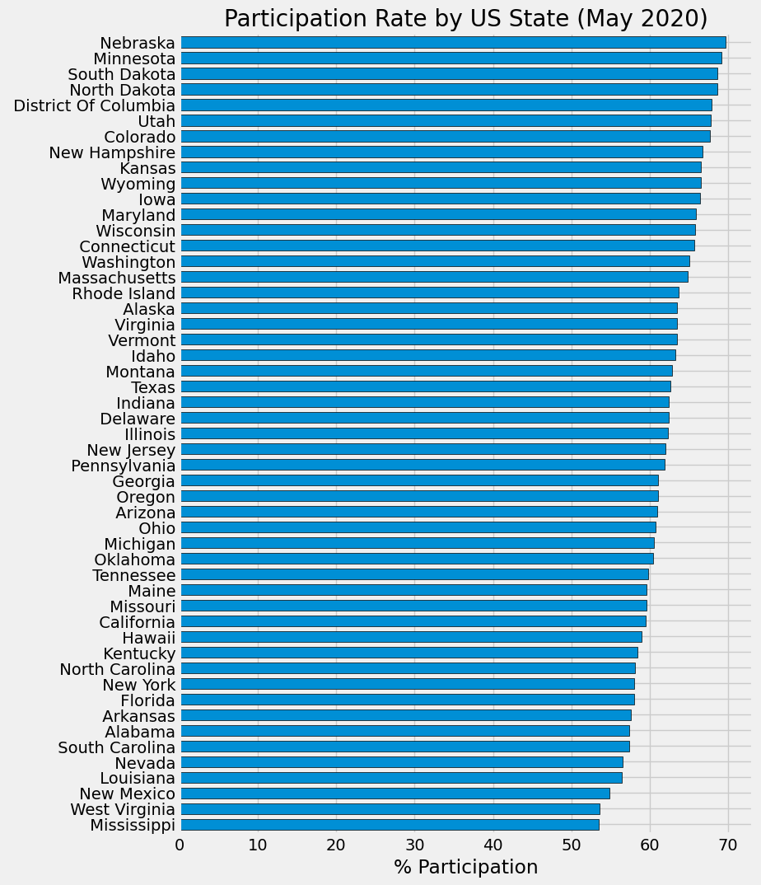
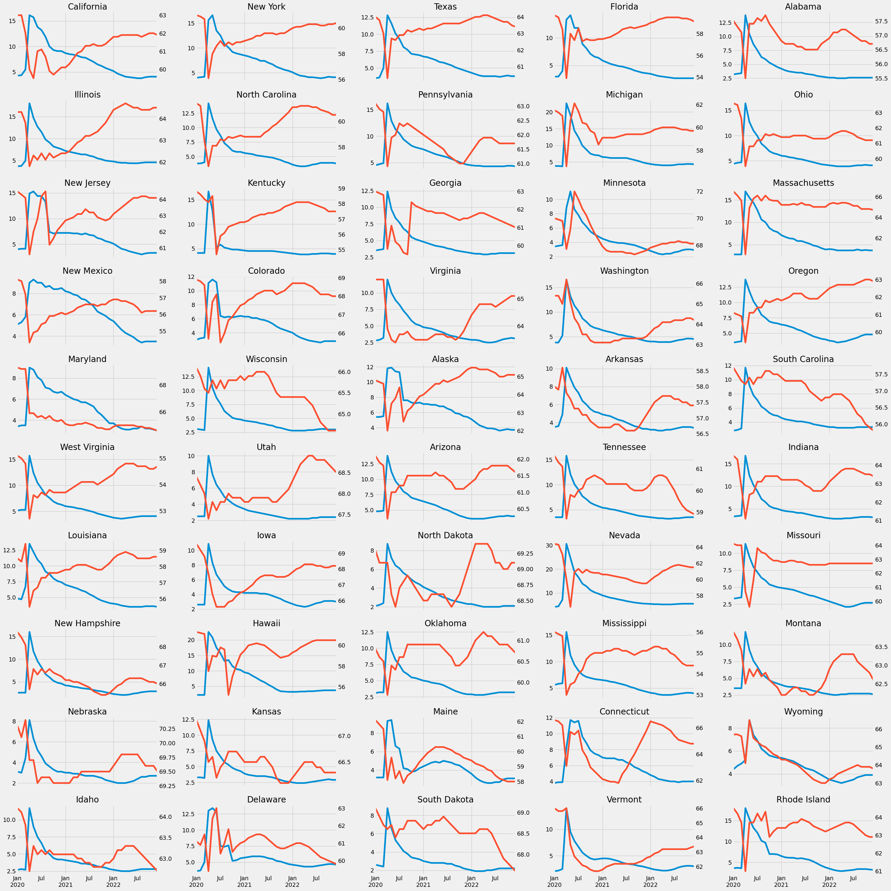

# Economic Data Analysis with FRED API

This economic data analysis project makes use of Python for data analysis, and the [FRED API](https://fredhelp.stlouisfed.org/fred/about/about-fred/what-is-fred/) for pulling out USA economic data about unemployment rates and participation rates per US state.

> [!NOTE]
> I recommend going to the [NBViewer URL](https://nbviewer.org/github/jpsam07/economic-data-analysis-with-fredapi/blob/76207ea857cb733df9eed150b1e91282cdf4cb03/notebook.ipynb) provided in the About section of this repository for a richer view of the analysis in a Jupyter Notebook

## Table of Contents

- [Request for FRED API Key](#request-for-fred-api-key)
- [Data Collection](#data-collection)
- [Environment Setup and Data Loading](#environment-setup-and-data-loading)
- [Data Cleaning](#data-cleaning)
- [Focused on May 2020 Economic Data](#focused-on-may-2020-economic-data)
- [Visualization of Unemployment Rates Per US State](#visualization-of-unemployment-rates-per-us-state)
- [Visualization of Participation Rates Per US State](#visualization-of-participation-rates-per-us-state)
- [Visualization of Unemployment Rate vs. Participation Rate Per US State](#visualization-of-unemployment-rate-vs-participation-rate-per-us-state)
- [Conclusion](#conclusion)
- [Next Steps](#next-steps)
- [References](#references)

## Request for FRED API Key

To get your own FRED API key:

1. Register for an account in [FRED](https://fred.stlouisfed.org/docs/api/fred/)

2. Go to `My Account > API Keys`

3. Click the Request API Key button

4. Copy the API key generated for your account

After doing those steps, you then have to paste your API key inside a `.py` file within a variable name of your choice.

You can then proceed to import the libraries required for analysis, and the API key from [FRED](https://fred.stlouisfed.org/docs/api/fred/)

## Data Collection

Using the FRED API key:
- Pulled in monthly unemployment rates per state in the USA
- Pulled in monthly labor participation rates per state in the USA

## Environment Setup and Data Loading

The economic data was loaded into Jupyter Lab using Python. Relevant libraries for data analysis were also imported:

- `pandas`: for Data Management and Data Manipulation
- `numpy`: for numerical and scientific computing
- `matplotlib`, `seaborn`, `plotly`: for data visualization
- `fredapi` : The API used to pull USA economic data
- `.py file with API key`: stored the API key requested from [FRED](https://fred.stlouisfed.org/docs/api/fred/)

## Data Cleaning

The data cleaning methods included:
- Filtering economic data with monthly frequency
- Specifically querying seasonally adjusted economic data whose unit is in percent
- Concatenating economic data 
- Dropping columns that are not about the unemployment and participation rates for every US state.
- Dropping missing values
- Fixed column names for better readability of the US states

## Focused on May 2020 Economic Data

- Pulled May 2020 unemployment rate data when it started skyrocketing
- Pulled May 2020 participation rate data when it started plummeting

## Visualization of Unemployment Rates Per US State

- Used `plotly` to enable interactive line chart visualization of Unemployment rates per US State

- Generated a bar chart that sorted unemployment rates per US state from highest to lowest

## Visualization of Participation Rates Per US State
- Used `plotly` to enable interactive line chart visualization of Participation rates per US State

- Generated a bar chart that sorted participation rates per US state from highest to lowest

## Visualization of Unemployment Rate vs. Participation Rate Per US State
- Plotted unemployment rate and participation rate in one big chart per US state.
	- `blue` for unemployment rate
	- `red` for participation rate

## Conclusion

Based on the final visualization, we can conclude a number of things:  

- It is safe to conclude that **as unemployment rate skyrocketed during May 2020, participation rate plummeted**.

	- This is around the time when the COVID-19 Outbreak started booming, not just affecting healthcare, but every industry and household worldwide.

- Over time, **participation rate increased as unemployment rate decreased.**

	- Some US States (e.g., Tennessee Montana, Maine, Idaho, Delaware, South Dakota) **seem to not follow the general trend**

## Next Steps

There might be some other economic factors affecting the labor and participation rates of these states during May 2020. Should the analysis of this economic data continues, this is something worth investigating.

## References

- Rob Mulla. (2022, April 26). _Economic Data Analysis Project with Python Pandas - Data scraping, cleaning and exploration!_ [Video]. YouTube. Retrieved November 22, 2023, from https://youtu.be/R67XuYc9NQ4?si=p0G707HjUCH6r1W-
- _St. Louis Fed Web Services: FRED® API_. (2009). Retrieved November 22, 2023, https://fred.stlouisfed.org/docs/api/fred/